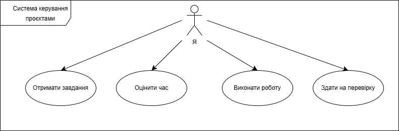

## Мій підхід до вирішення завдань

Я дотримуюсь системного підходу, який складається з чотирьох основних етапів:

1. **Аналіз вимог**: 
   Ретельне вивчення технічного завдання. На цьому етапі я виділяю ключові цілі, можливі обмеження та уточнюю незрозумілі моменти, щоб уникнути помилок у майбутньому.

2. **Планування**: 
   Розбиття великого завдання на менші підзавдання. Я визначаю пріоритети та оцінюю приблизний час, необхідний для кожного етапу.

3. **Виконання**: 
   Безпосередня реалізація завдання. Я пишу код або створюю контент, дотримуючись стандартів чистого коду та актуальних методологій розробки.

4. **Тестування та перевірка**: 
   Перевірка готового результату на відповідність початковим вимогам. Виправлення багів та фінальне полірування проєкту перед здачею.

---

## Взаємодія з системою керування проєктами

Для візуалізації процесу взаємодії з робочими завданнями я використовую UML Use Case діаграму. Вона демонструє основні сценарії використання системи під час мого типового робочого дня.

### UML Use Case діаграма

